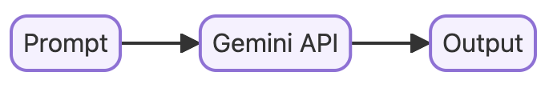
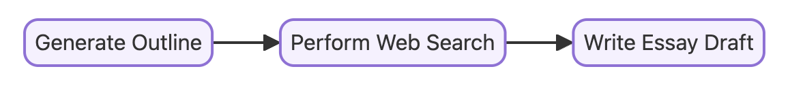
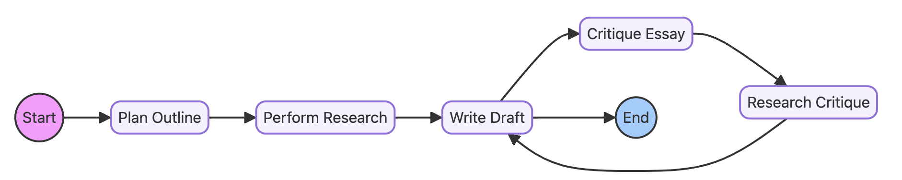

# AI Agents and their Use with Search

This notebook demonstrates 3 different approaches to generating essays using the Gemini Developer API or Gemini API in Vertex AI. Each method illustrates a distinct paradigm for running AI Agents in differing levels of complexity. The notebook is based on Google's workshop example.

## Overview

This notebook explores essay generation through three distinct methods, progressively showcasing the power and flexibility of the Gemini API:

1.  **Zero-Shot Approach with the Gemini API:**
    * A straightforward method where the Gemini API is directly prompted to generate an essay without any intermediate steps.
    * This approach highlights the basic capabilities of the model.
      
      

2.  **Step-by-Step Approach with LangChain:**
    * Utilizes LangChain to structure the essay generation process into sequential steps.
    * This method introduces the concept of chaining together different language model operations.
    * Includes the use of Tavily search, via LangChain, to gather information about the "2024 T20 World Cup" to improve the quality of the essay.
      
      

3.  **Iterative, AI-Agent Approach with LangGraph:**
    * Employs LangGraph to create an iterative agent that refines the essay through multiple rounds of generation and feedback.
    * Continues the use of Tavily search to refine and iterate the essay about the "2024 T20 World Cup" using an agentic approach.
    * This approach demonstrates a more sophisticated and dynamic way to leverage the Gemini API.
      
    

## Features

* Demonstrates the use of the Gemini Developer API or Gemini API in Vertex AI for essay generation.
* Illustrates the integration of Tavily search within LangChain and LangGraph for enhanced information retrieval.
* Provides examples of zero-shot, step-by-step, and iterative agent-based approaches.
* Focuses on the practical application of these methods in generating a relevant and informative essay about the 2024 T20 World Cup.

## Getting Started

To run this notebook, you will need:

* A Google Cloud project with the Vertex AI API enabled.
* The Gemini Developer API or access to the Gemini API in Vertex AI.
* Python with the necessary libraries installed (LangChain, LangGraph, Tavily, etc.).

Please refer to the notebook itself for detailed instructions on setting up your environment and running the code.

## Usage

Each section of the notebook corresponds to one of the three essay generation approaches. Follow the instructions within each section to execute the code and observe the results.

## Contributing

Contributions to this notebook are welcome! If you have suggestions for improvements or find any issues, please feel free to open a pull request or submit an issue.
